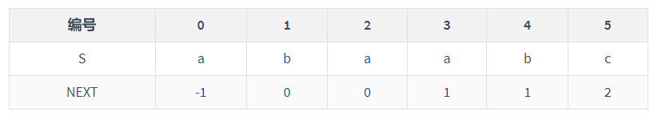

# 4、串

## 一、简单模式匹配

时间复杂度：O(mn)

## 二、KMP算法

时间复杂度：O(m+n)

### 求next数组

1. 求PM表：前缀与后缀并集中最长的子串的长度
2. 将PM表右移一位，首位补-1
3. 视情况+1
4. j从1开始



例：设主串T=“abaabaabcabaabc”，模式串S=“abaabc”，采用KMP算法进行模式匹配，到匹配成功为止，进行的单个字符比较次数是多少次？

- **求NEXT数组**

"a"：0

"ab"：0

"aba"：1

"abaa"：1

"abaab"：2

"abaabc"：0

右移补-1，得：

- **匹配**
  - 第一趟
    - T[5]与S[5]匹配失败
    - NEXT[5]=2
    - 从T[5]与S[2]开始继续匹配
  - 第二趟
    - 匹配成功
- 共计10次



### 求nextval数组

1. 先求next数组
2. 对于每一位，对比其next数组index对应的文本
3. 若一样，将那一位的值赋值给当前；若不一样，则保留不变
