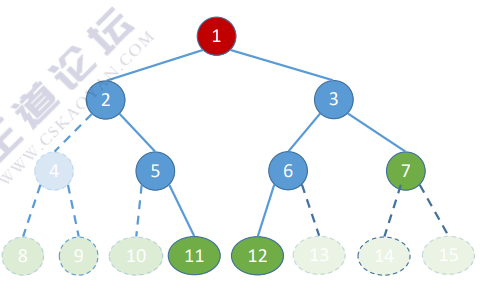
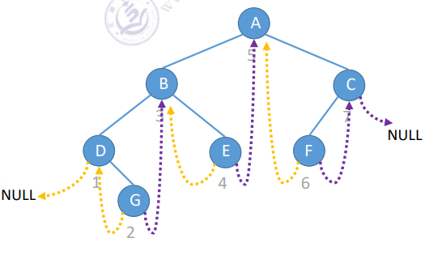
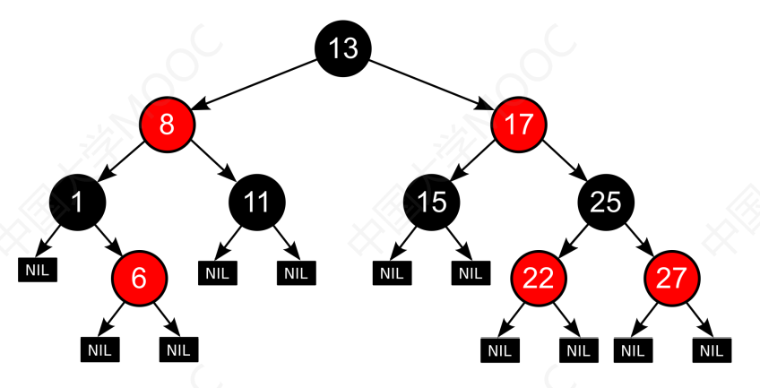
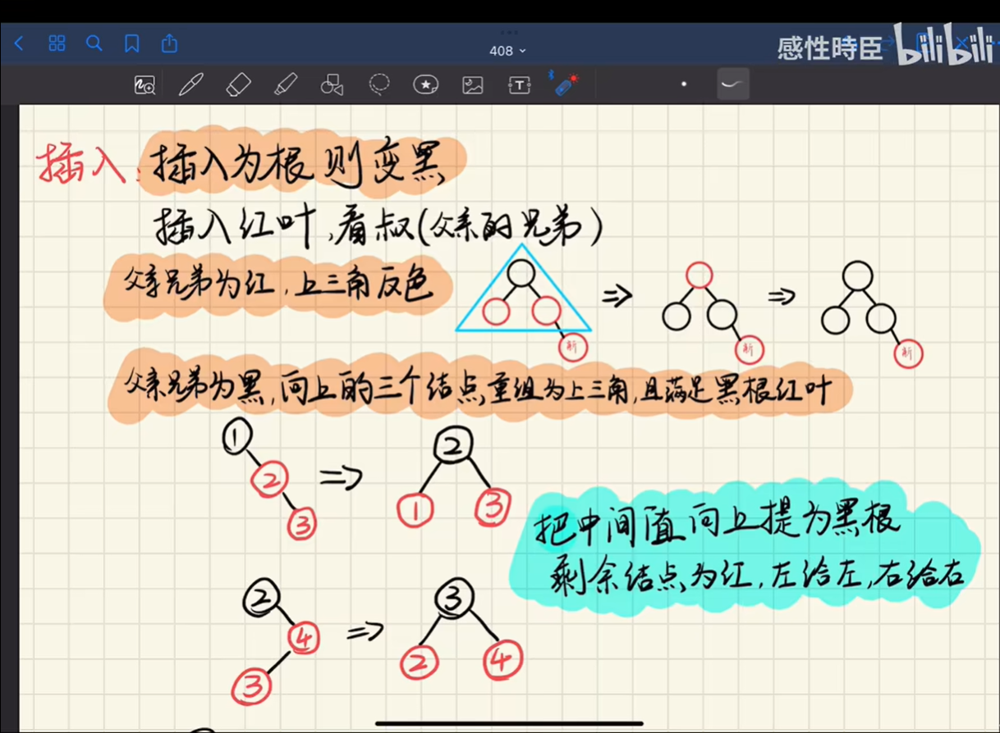

# 5、树

## 1、树的性质

* 节点数=所有节点的度数和+1
* 度为m的树第i层的节点数至多有：$$m^{i-1}$$
* 高为h，m叉树至多的节点数：

$$
\sum_{i=0}^{h}m^{i-1}=\frac{m^{h}-1}{m-1}
$$

* n个节点的m叉树最小高度为：$$\log_{m}[n(m-1)+1]$$向上取整

## 2、二叉树

* $$n_{0}=n_{2}+1$$
* 第K层的节点数至多有：$$2^{k-1}$$

### 顺序存储（完全二叉树）



```c
struct TreeNode {
    ElemType value; //结点中的数据元素
    bool isEmpty; //结点是否为空
};

TreeNode t [MaxSize]; //按照完全二叉树的顺序存储
```

链式存储

```c
typedef struct BiTNode{
    ELemType data; //数据域
    struct BiTNode *lchild, *rchild; //左、右孩子指针
}BiTNode ,*BiTree;
```

初始化

```c
//定义一棵空树
BiTree root = NULL;
//插入根节点
root = (BiTree) malloc(sizeof(BiTNode));
root-> data = {1};
root-> lchild = NULL;
root-> rchild = NULL;
//插入新结点
BiTNode * p = (BiTNode *) malloc(sizeof(BiTNode));
p->data = {2};
p-> lchild = NULL;
p-> rchild = NULL;
root->lchild = p; //作为根节点的左孩子
```

### 先序遍历（根-左-右）

```c
void PreOrder(BiTree T){
    if(T!=NULL){
        visit(T); //访问根结点
        PreOrder(T->lchild); //递归遍历左子树
        PreOrder(T- ->rchild); //递归遍历右子树
    }
}
```

### 中序遍历（左-根-右）

```c
void PreOrder(BiTree T){
    if(T!=NULL){
        PreOrder(T->lchild); //递归遍历左子树
        visit(T); //访问根结点
        PreOrder(T- ->rchild); //递归遍历右子树
    }
}
```

### 后序遍历（左-右-根）

```c
void PreOrder(BiTree T){
    if(T!=NULL){
        PreOrder(T->lchild); //递归遍历左子树
        PreOrder(T- ->rchild); //递归遍历右子树
        visit(T); //访问根结点
    }
}
```

层序遍历

* 将根节点入队
* 队列非空
  * 将队头出队，访问该节点
  * 将该节点的左、右孩子依次插入队尾
* 重复直至队列为空

```c
//链式队列结点
typedef struct LinkNode{
    BiTNode * data; //保存的是节点的指针
    struct LinkNode *next;
}LinkNode;

typedef struct{
    LinkNode *front, *rear; //队头队尾
}LinkQueue;

//层序遍历
void Level0rder(BiTree T){
    LinkQueue Q;
    InitQueue(Q); 					//初始化辅助队列
    BiTree p;
    EnQueue(Q,T); 					//将根结点入队
    while(!IsEmpty(Q)){ 			//队列不空则循环
        DeQueue(Q，p); 			   //队头结点出队
        visit(p); 					//访问出队结点
        if(p->lchild != NULL)
        	EnQueue(Q, p->lchild);  //左孩子入队
        if(p->rchild != NULL)
        	EnQueue(Q, p->rchild);  //右孩子入队
    }
}
```

### 线索二叉树



* 左指针指向中序前驱
* 右指针指向中序后继

```c
//全局变量pre,指向当前访问结点的中(前、后)序前驱
ThreadNode *pre=NULL;

typedef struct BiTNode{
    ELemType data; //数据域
    struct BiTNode *lchild, *rchild; //左、右孩子指针
    int ltag, rtag; //左、 右线索标志：0表示孩子，1表示线索
}BiTNode ,*BiTree;
```

中序线索化

```c
void visit(ThreadNode *q) {
    if(q->lchild == NULL) { //当前节点左子树为空,建立前驱线索
        q->lchild = pre;
        q->ltag = 1;
    }
    if(pre != NULL && pre->rchild == NULL) {
        pre->rchild = q; //前驱结点的右子树为空，建立后继线索
        pre->rtag = 1;
    }
    pre=q;
}
```

前后序类似，注意

* 最后再修改一次per的后继节点为null
* 遍历时判断左右子树是孩子还是线索

孩子-兄弟表示法：左孩子右兄弟

|   树  |  森林  |  二叉树 |
| :--: | :--: | :--: |
| 先根遍历 | 先序遍历 | 先序遍历 |
| 后根遍历 | 中序遍历 | 中序遍历 |

### 二叉排序树的删除

* 叶子：直接删
* 只有左/右子树：直接删，用子树顶替
* 同时有左右子树
  * 用后继节点顶替：右子树中最左下的
  * 用前驱节点顶替：左子树中最右下的

### AVL树

#### ALV树的结点数量

h为树高

$$n_h$$为树高为h时的最小节点数

$$
n_0 = 0\\ n_1=1\\ n_2=2\\ n_h=1+n_{h-1}+n_{h-2}
$$

#### ALV树的插入

（在某节点的）L【左孩子】（的）R【右子树】（中插入导致不平衡）

* LL：左孩子右上旋
* RR：右孩子左上旋
* LR
  * 左孩子的右孩子左上旋，变成新的左孩子
  * 新的左孩子右上旋
* RL
  * 右孩子的左孩子右上旋，变成新的右孩子
  * 新的右孩子左上旋

### 哈夫曼树

* 权值最小的两个组成兄弟
* 根节点的权值等于两个孩子相加
* 由n个节点建立哈夫曼树的过程中新建了n-1个节点

### 红黑树

* 本质是二叉排序树：左<根<右
* 结点只有两种颜色
* 根结点是黑色的
* 叶结点（失败结点、NULL结点）是黑色的
* 没有两个相邻的红节点
* 从任何一个结点到叶子节点的简单路径上黑节点的数量相同
* 设共有n个节点，则红黑树的树高：$$h\leq2\log_2(n+1)$$



```c
struct RBnode{
    int key;
    RBnode* parent;		//父节点
    RBnode* lChild;		//左孩子
    RBnode* rChild;		//右孩子
    int color;			//结点颜色
}
```

**插入原则**

* 确定插入位置（同二叉排序树）
  * 新节点是根：染为**黑色**
  * 新节点非根：染为<mark style="color:red;">**红色**</mark>
* 若插入后满足特性，插入结束
  * 插入只会破坏 “没有两个相邻的红节点” 这一特性
  * 除非是根节点，只要满足这一特性即可
* 否则，观察叔叔节点（父节点的兄弟）
  * 叔叔节点为**黑色**：旋转+染色
    * LL：右旋，父换爷+染色
    * RR：左旋，父换爷+染色
    * LR：左、右旋，儿换爷+染色
    * RL：右、左旋，儿换爷+染色
  * 叔叔节点为<mark style="color:red;">**红色**</mark>
    * 叔、父、爷染色，将爷节点视为新节点再继续处理



## 3、并查集

### 表示

* 通过森林表示多个集合
* 使用<mark style="color:purple;">**双亲表示法**</mark>来存储并查集
  * 每个节点中保存指向双亲的“指针”
  * 根节点指针为-1
* **查**：向上遍历，找到根节点，判断是否在同一个集合里
* **并**：将两棵树的根节点相连

### 代码实现

```c
#define SIZE 13;
int UFSets[SIZE];		//数组中存储每个节点的根

//初始化
void Initial(int S[]){
    for(int i=0; i<SIZE; i++){
        S[i]=-1;		//先全部设为单独的子集
    }
}

//查
int Find(int S[], int x){
    while(S[x]>=0){
        x = S[x];
    }
    return x;
}

//并
void Union(S[], int Root1, int Root2){
    if(Root1 != Root2){
        S[Root2] = Root1;
    }
}
```

* 时间复杂度
  * 并：O(1)
  * 查：O(n)

### 对union操作的优化

* 让高度低的树成为子树
* 根节点的绝对值表示树中的节点总数（-6、-3……）
* 合并时将根节点相加

```
void Union(S[], int root1, int root2){
    if(root1 != root2){
        if(S[root2] > S[root1]){
            S[root1] += S[root2];	//累加节点总数
            S[root2] = S[root1];	//小树合并到大树
        }else{
            S[root2] += S[root1];
            S[root1] = S[root2];
        }
    }
}
```

树高不超过$$\lfloor \log_2n \rfloor + 1$$

时间复杂度

* 并：O(1)
* 查：O($$\log_2n$$)

### 对find操作的优化

* 在查找某个节点找到根节点后，将路径上所有的节点都直接挂到根节点下

```c
int Find(int S[], int x){
    int root = x;
    while(S[x]>=0){
        root = S[x];
    }
    while(x != root){
        int temp = S[x];
        S[x] = root;
        x = remp;
    }
    return root;
}
```
