# 6、图

## 1、概念

- **顶点**
- **简单图**：没有指向自己的边、没有重复的边
- **无向图**

  - **无向边（边）**
  - **度**：边/2
  - **连通**：两顶点间有路径存在
  - **连通图**：任意两个顶点都是联通的
    - 连通图最少边：n-1
    - 非连通图最多边：$$C_{n-1}^{2}$$
  - **连通分量**：极大连通子图（包含尽可能多的子图和边）
  - **完全图**：：任意两个顶点之间都存在边
- **有向图**

  - **有向边（弧）**
  - **入度、出度**：有向图的度=入度+出度
  - **强连通**：两个顶点之间正向、逆向均有路径
  - **强连通图**：任意两个顶点之间都是强连通的
    - 强连通的最少边：n（环）
  - **连通分量**：极大强连通子图（必须强连通、包括尽可能多的边和点）
  - **完全图**：任意两个顶点之间都存在方向相反的两条弧
- **简单图**：没有指向自己的边、没有重复的边
- **路径**：两个顶点之间的顶点序列
- **回路**：第一个顶点和最后一个顶点相同的路径
- **简单路径**：路径中所有的顶点不重复出现
- **简单回路**：除了第一个和最后一个顶点外，其它顶点不重复
- **路径长度**：路径上**边**的数量
- **顶点到顶点的距离**：最短路径（若存在）
- **子图**：首先是个图。分别取点集和边集的子集构成
- **生成子图**：子图中包含了原图的所有顶点
- **生成树**：包含**全部顶点**的一个极小连通子图（边尽可能少、保持联通）
- **生成森林**：由非连通图各个连通分量的生成树构成
- **带权图**
  - **边的权**：边所带的权值
  - **带权路径长度**：路径上所有边的权值之和
- **树**：不存在回路且连通的无向图

## 2、表示

### 邻接矩阵

```c
#define MaxVertexNum 100 					 //顶点数目的最大值
typedef struct{
    char Vex [MaxVertexNum] ;				 //顶点表
    int Edge [MaxVertexNum] [MaxVertexNum] ; //邻接矩阵，边表
    int vexnum, arcnum;						 //图的当前顶点数和边数/弧数
} MGraph;
```

有向图：

- 出度：行
- 入度：列


- **优点**
  - 快速查找两点之间是否有边
- **缺点**
  - 不适用于查找从某点出发的所有边


### 邻接表法

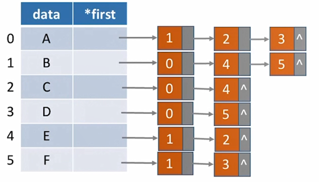

```c
//"边/弧"
typedef struct ArcNode{
    int adivex; 			//边/弧指向哪个结点
    struct ArcNode *next ;  //指向下一条弧的指针
    //InfoType info; 		//边权值
}ArcNode;

//"顶点"
typedef struct VNode{
    VertexType data; 		//顶点信息
    ArcNode *first;			//第一条边/弧
}VNode,AdjList [MaxVertexNum];

//用邻接表存储的图
typedef struct{
    AdjList vertices;
    int vexnum, arcnum;
}ALGraph;
```

- **十字链表**：有向图
- **邻接多重表**：无向图


- **优点**
  - 快速查找从某点出发的所有边
- **缺点**
  - 不适用于查找某两点之间是否有边


## 3、遍历

### 广度优先BFS

- 节点入队
- 队列非空，则将队头出队
- 访问队头节点的相邻节点，并将之存入队尾
- 循环操作直至队空

```c
bool visited [MAX_ VERTEX_ NUM]; // 访问标记数组

void BFSTraverse(Graph G){  	//对图G进行广度优先遍历
    for(i=0; i<G.vexnum;++i) 
    	visited [i]=FALSE;  	//访问标记数组初始化
    InitQueue(Q) ;				//初始化辅助队列Q
    for( i=0; i<G.vexnum; ++i)	//从0号顶点开始遍历
    	if(!visited[i])			//对每个连通分量调用一次BI
    		BFS(G,i);			//vi未访问过，从vi开始BF
}

//广度优先遍历
void BFS(Graph G,int v){		 //从顶点v出发，广度优先遍历图G 
    visit(v);					 //访问初始顶点v
    visited[v]=TRUE;			 //对v做已访问标记
    Enqueue(Q,v);				 //顶点v入队列Q
    while(!isEmpty(Q)){
        DeQueue(Q,v);			 //顶点v出队列
        for(w=FirstNeighbor(G, v); w>=0; w=NextNeighbor(G,v,W))
        //检测v所有邻接点
        if(!visited [w]){		 //w为v的尚未访问的邻接顶点
            visit(w);			 //访问顶点w
            visited[w]=TRUE;	 //对w做已访问标记
            EnQueue(Q,W); 		 //顶点w入队列
        }//if 
    }//while
}

```

BFS函数调用的次数=连通分量数

**时间复杂度**：

- 邻接矩阵表示：
  - 访问所有顶点：O(V)
  - 访问每个顶点的邻接点：O(V)
  - 总时间复杂度：$$O(V^2)$$
- 邻接表表示：
  - 访问所有顶点：O(V)
  - 访问各个顶点的邻接点：O(E)
  - 总时间复杂度：$$O(V+E)$$


### 深度优先DFS

```c
bool vis ited [MAX_ VERTEX_ NUM]; 	//访问标记数组

void DFSTraverse(Graph G){			//对图G进行深度优先遍历
    for(v=0; v<G.vexnum; ++v)
    	visited[v]=FALSE;			//初始化已访问标记数据
    for(v=0; v<G.vexnum; ++v)		//本代码中是从v=0开始遍历
    	if( !visited[v])
    		DFS(G,v);
}

void DFS(Graph G,int v){			//从顶点v出发，深度优先遍历图G
    visit(v);						//访问顶点v
    visited[v]=TRUE;				//设已访问标记
    for (w=FirstNeighbor(G, v);W>=0;w=NextNeighor(G,v,w)
    	if(!visited[w]){ 			//w为u的尚未访问的邻接顶点
    		DFS(G,w);
    	}//if
}

```

DFS调用的次数=顶点数

**时间复杂度**：

- 邻接矩阵表示：
  - 访问所有顶点：O(V)
  - 访问每个顶点的邻接点：O(V)
  - 总时间复杂度：$$O(V^2)$$
- 邻接表表示：
  - 访问所有顶点：O(V)
  - 访问各个顶点的邻接点：O(E)
  - 总时间复杂度：$$O(V+E)$$

## 4、最小生成树

- Prim算法
  - 每次将代价最小的顶点接入树
  - 适合边稠密的图
  - 时间复杂度为：$$O(|V^2|)$$
- Kruskal算法
  - 每次选择权值最小的边，连接这条边的两个节点（两顶点不能都在已有集合中）
  - 适合边稀疏的图
  - 采用堆存放边的集合
  - 时间复杂度
    - 每次选择最小权值的边：$$O(\log |E|)$$
    - 总时间复杂度：$$O(|E|\log |E|)$$

## 5、最短路径

### Dijkstra算法

- 从某点除法，遍历所有未确定最短路径的点，算出其距离
- 选择未确定的点中距离最短的作为下一个遍历的目标，并将其路径设为true
- 将距离改为从新的点出发的路径中最短的
- 不适合求有负权值的图

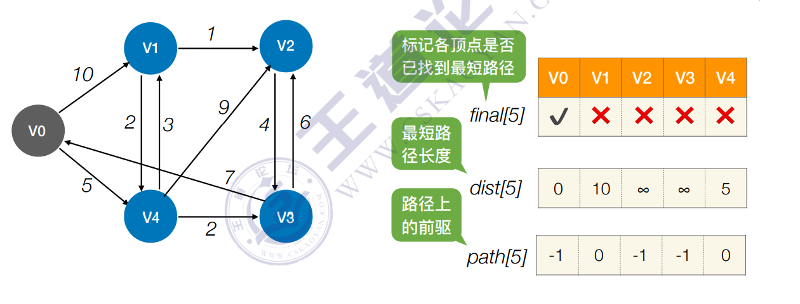

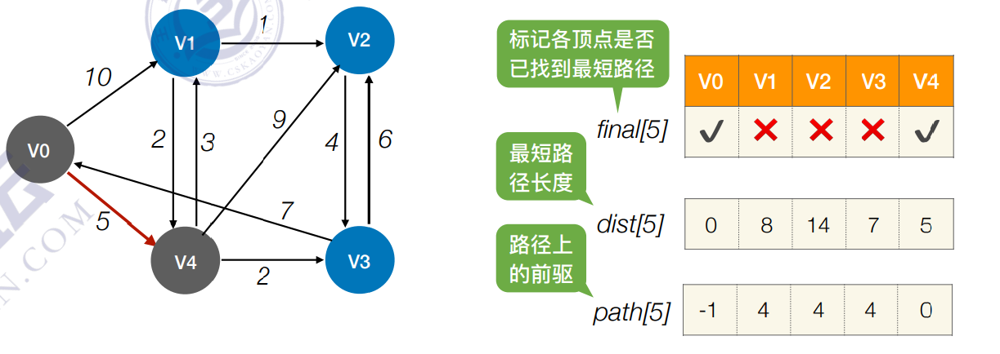

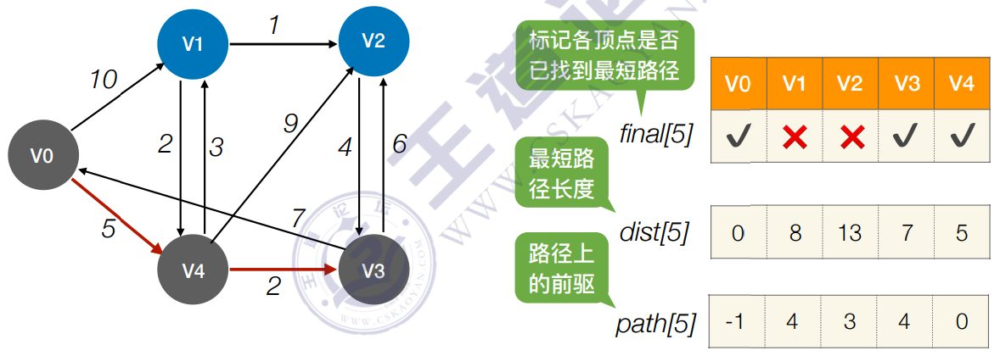

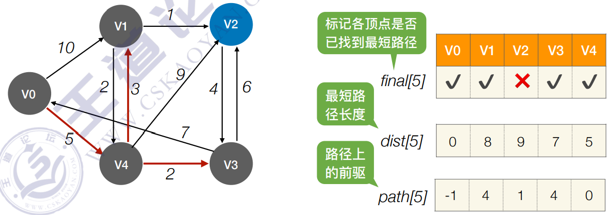

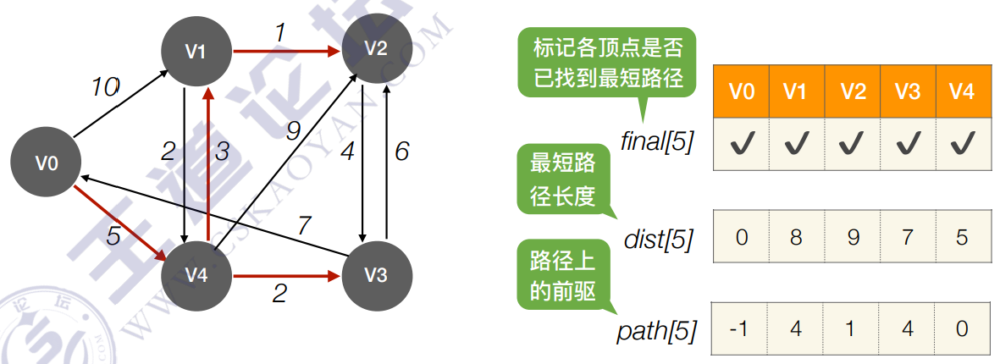


### Floyd算法

- 首先不允许任何定点作为中转

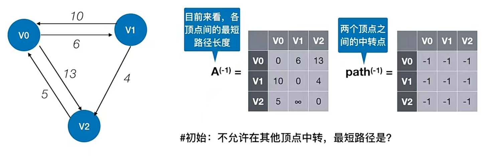

- 接下来允许在$$V_0$$中转
  - 对比原来$$A^{(-1)}$$矩阵中$$A^{(-1)}[i][k]$$与$$A^{(-1)}[i][j]+A^{(-1)}[j][k]$$
  - 若中转路径大 ，则替换为新的，并修改$$path^{(0)}[i][k]=0$$
  - 例：$$A^{(-1)}[2][1]>A^{(-1)}[1][0] + A^{(-1)}[0][2]=11$$

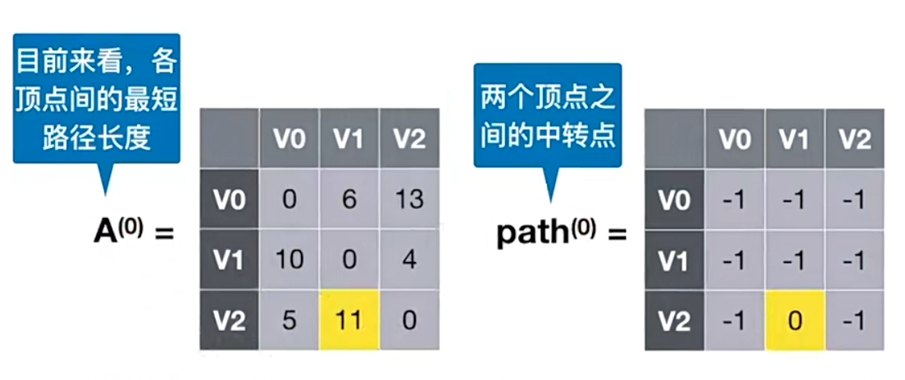

- 允许在$$V_0$$、$$V_1$$中转

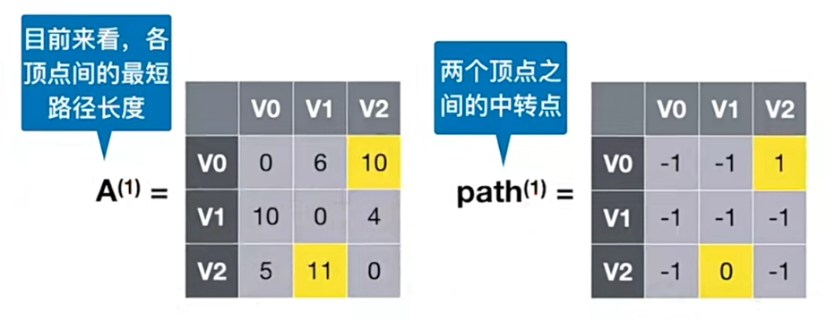

- 允许在$$V_0$$、$$V_1$$、$$V_2$$中转

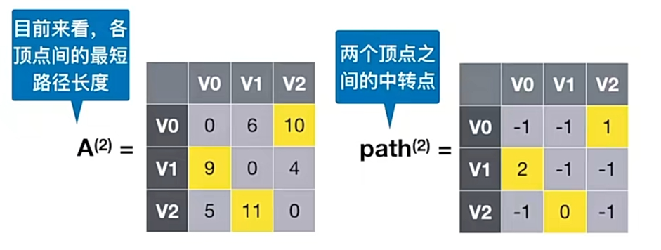

- **查询最短路径**
  - $$A^{(2)}[1][2]=4$$，$$\text{path}^{(2)}[1][2]=-1$$：
    - $$V_1$$到$$V_2$$的最短路径为4
    - 不经过中转
  - $$A^{(2)}[0][2]=10$$，$$\text{path}^{(2)}[0][2]=1$$：
    - $$V_0$$到$$V_2$$的最短路径为10
    - 经过$$V_1$$中转

```c
for (int k=0; k<n; k++){					//以Vk为中转点
	for (int i=0; i<n; i++){				//遍历矩阵，i行j列
		for (int j=0; j<n; j++){
			if (A[i][j]>A[i][k]+A[k][j]){
				A[i][j]=A[i][k]+A[k][j];
				path[i][j]=k;
			}
		}
	}
}
```

- **时间复杂度**：$$O(|V|^3)$$
- **空间复杂度**：$$O(|V|^2)$$两个矩阵

**实例**：

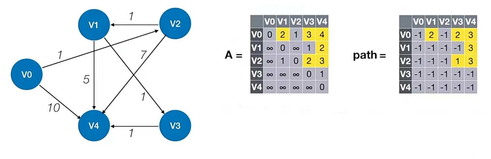

求$$V_0$$到$$V_4$$的最短路径

1. 中转点为3
2. $$V_0$$到$$V_3$$中转点为2
3. $$V_0$$到$$V_2$$直接相连
4. 目前路径为$$V_0 - V_2 - V_3 - V_4$$
5. $$V_2$$到$$V_3$$中转点为1
6. 最短路径为$$V_0 - V_2 - V_1 - V_3 - V_4$$，为4

## 6、拓扑排序

**DAG图**：有向无环图

**AOV网**：使用DAG图表示一个工程，顶点表示活动

**拓扑排序**：找到做事的先后顺序

- 从AOV网中找一个入度为0的顶点并输出
- 从AOV网中删除这个顶点和所有以它为起点的边
- 重复直到AOV网为空或者不存在入度为0的点为止

```c
bool TopologicalSort(Graph G){
    InitStack(S);			//初始化栈， 存储入度为0的顶点
    for(int i=0; i<G.vexnum; i++)
        if (indegree[i]==0)
        	Push(S,i);		//将所有入度为0的顶点进栈
    int count=0;			//计数，记录当前已经输出的顶点数
    while(!IsEmpty(S)){ 	//栈不空，则存在入度为0的顶点
        Pop(s,i);			//栈顶元素出栈
        print[count++]=i;	//输出顶点i
        for(p=G.vertices[i].firstarc; p; p=p->nextarc){
            //将所有i指向的顶点的入度减1，并且将入度减为0的顶点压入栈S
            v=p->adjvex;
            if(!(--indegree[v]))
            	Push(S,v);	//入度为0，则入栈
        }
    }//while
    if(count<G .vexnum)
    	return false;		//排序失败，有向图中有回路
    else
    	return true;		//拓扑排序成功
}

```


## 7、关键路径

**AOE网**：带权有向图，用边表示活动，边的权值表示活动的开销

**关键路径**：具有最大路径长度的路径，决定整个事件的完成时间

**最早开始时间**：弧起点所表示的事件最早开始的时间

**最迟开始时间**：弧尾所表示的事件最晚开始的时间

**时间余量**：不影响整个工程的情况下，事件可以拖延的时间

**关键活动**：时间余量为0的活动

