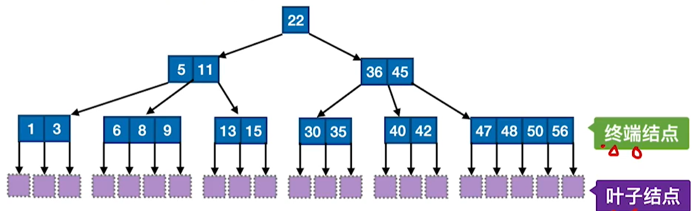

# 7、查找

## 1、顺序查找

- 顺序存储
- 链式存储

```c
typedef struct{
    ELemType *elem;	//动态数组基址
    int TableLen;	//表的长度
}SSTable

//顺序查找
int Search_ Seq (SSTable ST, ElemType key){
    int i;
    for(i=0;i<ST. TableLen && ST.elem[i] !=key; ++i);
    //查找成功，则返回元素下标;查找失败，则返回-1
    return i== =ST. TableLen? -1 : i;
}

```

无序表的ASL：$$\frac{n+1}{2}$$

有序表的ASL：$$\frac{n}{2}+\frac{n}{n+1}$$

## 2、折半查找

- 顺序存储（有序）

```c
typedef struct{
    ELemType *elem;	//动态数组基址
    int TableLen;	//表的长度
}SSTable
    
//折半查找
int Binary_Search(SSTable L, ElemType key){
    int low=0 , high=L.TableLen-1, mid;
    while(low<=high){
        mid=(low+high)/2;	//取中间位置
        if(L.elem[mid]==key)
        	return mid;		//查找成功则返回所在位置
        else if(L.elem[mid]>key)
        	high=mid-1;		//从前半部分继续查找
        else
        	low=mid+1;		//从后半部分继续查找
    }
    return -1;//查找失败，返回-1
}

```

判定树高：$$\log_{2}(n+1)$$

查找成功的ASL：$$\log_2(n+1)-1$$


## 3、分块查找

用折半查找找分块索引表（low>high时查找失败，则取现在low所指向的分块）

在分块内用顺序查找

设共有n条记录，则分块长度最理想应为$$\sqrt n$$

## 4、B树

- 树结构
  - 顺序存储
  - 链式存储

### 定义



- B树中所有结点的孩子个数的最大值称为B树的阶，对于m阶B树
- 树中每个结点至多有m棵子树，即至多含有m-1个关键字
- 若根结点不是终端结点，则至少有两棵子树
- 除根结点外的所有非叶结点至少有$$\lceil m/2\rceil$$棵子树，即至少含有$$\lceil m/2\rceil-1$$个关键字
- 所有的叶结点都出现在同一层次上，并且不带信息(可以视为外部结点或类似于折


### 计算

设树的阶数为m，有n个关键字，树高记为h

- **最大树高**：$$n+1\geq2(\lceil m/2\rceil)^{h-1} \Rightarrow \text{H}_{max}\leq\log_{\lceil m/2\rceil}((n+1)/2)+1$$
- **最小树高**：$$n\leq m ^h -1 \Rightarrow \text h_{min}\geq \log_m(n+1)$$


### 插入

设为m阶B树，即每个节点中最多只能插入m-1个关键字

- 当节点不满时，直接插入关键字
- 节点已满
  - 将当前节点的中间的关键字提为父节点
  - 将原节点中剩下的关键字拆分为两个


### 删除

- **非终端节点**：用**直接前驱**代替删除的节点
- **终端节点**
  - 节点中关键字没有低于下限：直接删除
  - 节点中关键字数量低于下限
    - 兄弟够借
      - 从兄弟中借一个变成父节点
      - 原父节点拉下来补充
    - 兄弟不够借
      - 将两个节点合并
      - 将两个节点中间的父节点也合并进来
      - 此时若父节点不够，则继续按照此逻辑处理


### B+树


- 记录数=叶子节点数
- 类似于索引分块查找
- B+树支持**顺序查找**

## 5、散列表

- 顺序存储
- 链式存储

### 散列函数

- 直接定址法：$$H(key)= a\times key+b$$
- 除留余数法：$$H(key)=key\%p$$
- 数字分析法
- 平方取中法

### 冲突处理

- 开放定址法
  - 线性探测法：向后推移
  - 平方探测法（二次探测法）：推移的距离变为$$0^2、1^2、-1^2……k^2、-k^2$$
  - 双散列法（再散列法）：使用另一个散列函数再次计算
  - 伪随机序列法：推移的距离是伪随机序列
- 拉链法：直接挂在链表后面

### 参数

表长为m，p为不大于m的质数。

- 装填因子：$$\frac{记录数}{表长}$$
- 成功的平均查找长度：$$\frac{每个元素的查找长度}{元素数量}$$
- 失败查找长度：$$\frac{可能取值范围内的元素查找失败长度}{可能的取值范围}$$
  - 可能的取值范围取决于p的值，即[0, p-1]
