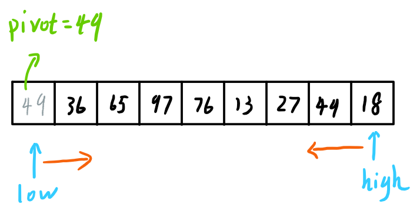

# 排序

基于比较的排序，n个关键字，比较次数为 $$\lceil \log_2(n!) \rceil$$

## 1、插入排序

- 每次把一个元素插入到前面的已排序序列中
- 可以用折半查找快速找到插入位置
  - 对当前插入节点前面的顺序队列使用折半查找
  - 先确定位置再插入

```c
//直接插入排序
void InsertSort(int A[],int n){
    int i,j, temp ;
    for(i=1;i<n;i++){		//将各元素插入已排好序的序列中
        if(A[i]<A[i-1]){	//若A[i]关键字小于前驱
        	temp=A[i];		//用temp暂存A[i]
            for(j=i-1;j>=0 && A[j]>temp;-- j){ //检查所有前面已排好序的元素
                A[j+1]=A[j];//所有大于temp的元素都向后挪位
            }
            A[j+1]=temp;	//复制到插入位置
        }
    }
}
```

- 空间复杂度：$$O(1)$$
- 时间复杂度：$$O(n^2)$$
- 最坏情况下的比较次数：$$n(n-1)/2$$
- 稳定
- 可用于链表，但不再能使用折半查找确定插入位置

## 2、希尔排序

- 按照不同的间隔分为几个子表
- 对每个子表进行插入排序
- 间隔每轮**缩短**一次
  - 距离每次缩小一半
  - 表现为每次的子表中元素数量为2、4、6……
- 直到间隔变为1

```c
//希尔排序
void ShellSort(int A[],int n){
    //A[0]只是暂存单元，不是哨兵，当j<=0时，插入位置已到
    for(int d= n/2; d>=1; d=d/2){		//步长变化
        //遍历每一个子表
        for (int i = 1; i <= d; i++) {
            //对每一个子表插入排序
            for (int j = i + d; j <= n; j += d) {
                if (A[j] < A[j - d]) {
                    A[0] = A[j];
                    for (int k = j - d; k > 0; k -= d) {
                        if (A[k] > A[0]) {
                            A[k + d] = A[k];
                            A[k] = A[0];
                        }
                    }
                }
            }
    	}
    }
}
```

- 空间复杂度：$$O(1)$$
- 不稳定
- 不适用于链表

## 3、冒泡排序


- 从**最后开始**，相邻的两两对比
  - 决定是否交换顺序
- 每次确定最小的一个（即最前面的一个）
- 下一次对比不再管已经对了的
- 共需要n-1次冒泡

```c
//冒泡排序.
void BubbleSort(int A[],int n){
    for(int i=0;i<n-1;i++){
        bool flag=false;	//表示本趟冒泡是否发生交换的标志
        //一趟冒泡
        for(int j=n-1;j>i;j--){
            if(A[j-1]>A[j]){		//若为逆序
                swap(A[j-1],A[j]);	//交换
                flag=true;
            }
        }
        if(flag==false)
        	return ;		//本趟遍历后没有发生交换，说明表已经有序
    }
}

```

- 空间复杂度：$$O(1)$$
- 时间复杂度：$$O(n^2)$$
- 稳定
- 可用于链表

## 4、快速排序


- 每一趟确定一个点的最终位置
- 左边全部比他小，右边全部比他大
- 将目标点的位置腾空，之后low和high哪一个指向不空的就移动哪一个
- 对左右两部分再次做如上处理



快速排序：

```c
void QuickSort(int A[], int low, int high){
    if(low < high){ //跳出的条件
        int pivotpos = Partition(A, low, high); //划分
        QuickSort(A, low, pivotpos-1); //左子表
        QuickSort(A, pivotpos+1, high); //右子表
    }
}
```

划分左右子表：

```c
int Partition(int A[], int low, int high){
    int pivot = A[low];
    while(low < high){ //直到两个指针碰面，退出循环
        while(low < high && A[high] >= pivot){
            high--; //high左边全部大于pivot
        }
        A[low] = A[high]; //将小于pivot的移到右边
        
        while(low<high && A[low] <= pivot){
            low++; //low右边全部小于pivot
        }
        A[high] = A[low] //将大于pivot的移到左边
    }
    
    A[low] = pivot; //pivot的最终位置确定
    return low;
}
```

递归次数：


递归次数=二叉树的深度 $$\in (\log_{2}n -1,n)$$

- 时间复杂度：O(n*递归层数)
  - 最好时间复杂度：O($$n\log_{2}n$$)
  - 最坏时间复杂度：O($$n^{2}$$)
- 空间复杂度：O(递归层数)
  - 最好空间复杂度：O($$\log_{2}n$$)
  - 最坏空间复杂度：O(n)

## 5、简单选择排序


- 每一次扫描未排序队列，找到其中最小的
- 将最小的移动到开头
- 下一次再遍历新的未排序队列
- 只剩下一个时代表排序结束

```c
//简单选择排序
void SelectSort(int A[],int n){
    //一共进行n-1趟
    for(int i=0;i<n-1;i++){
        int min=i;			//记录最小元素位置
        //在A[i...n-1]中选择最小的元素
        for(int j=i+1;j<n;j++)
        	if(A[j]<A[min])
                min=j;		//更新最小元素位置
        if(min!=i)
            swap(A[i],A[min]); //将最小值与本次遍历开头元素交换
    }
}
```

- 空间复杂度：$$O(1)$$
- 时间复杂度：$$O(n^2)$$
- 不稳定

## 6、堆排序

- 堆：属于**完全二叉树**
  - 小根堆：根 ≤ 左、右
  - 大根堆：根 ≥ 左、右
  
- 建立大根堆
  - 检查各个根节点是否大于叶子
  - 完全二叉树中，下标i < n/2向**下取整**的节点为根节点
  - 左孩子：2i
  - 右孩子：2i+1
  - 将根节点与**较大的**孩子互换
  
- 堆排序
  - 每次将最上层的根节点与无序队列最后一个元素呼唤
    - 每次确定一个最终最大值
    - 从队尾开始是正确序列
  - 对新的换上来的根进行调整，形成新的大根堆
  - 得到**递增序列**
  - 最终的树是层序的
  
  

```c
//建立大根堆
void BuildMaxHeap(int A[], int len){
    for(int i=len/2;i>0;i--) //从后往前调整所有非终端结点
    	HeadAdjust(A,i,len);
}
//将以k为根的子树调整为大根堆（元素K不断下坠）
void HeadAdjust(int A[],int k,int len){
    A[0]=A[k];					//A[0]暂存子树的根结点
    //沿key较大的子结点向下筛选
    for(int i=2*k;i<=len;i*=2){	//先指向左孩子2k
    if(i<len&&A [i]<A[i+1])		//若右孩子存在，对比左右孩子
    	i++;					//若右孩子更大则指向右孩子
    //对比最大孩子和根节点
    if(A[0]>=A[i])
        break;		//筛选结束
    else{
        A[k]=A[i] ; //将A[i]调整到双亲结点上
        k=i;		//修改k值，以便继续向下筛选
    }
    A[k]=A[0];					//被筛选结点的值放入最终位置
}

//堆排序
void HeapSort(int A[] ,int Len){
    BuildMaxHeap(A, len);		//初始建堆
    //n-1趟的交换和建堆过程
    for(int i=len;i>1;i--){
        swap(A[i],A[1]);		//堆顶元素和堆底元素交换
        HeadAdjust(A,1,i-1);	//把剩余的待排序元素整理成堆
    }
}
```

- 节点每下坠一层，最多对比2次
- 树高h，节点在第i层，则
  - 最多下坠 h-i 层
  - 最多对比 2(h-i) 次
- n个元素（节点）的完全二叉树高：$$\lfloor\log_2n\rfloor+1$$
- 第i层最多有$$2^(i-1)$$个节点（根为0层）
- 只有非底层（1~(h-1)）层节点可能下坠
- 建堆
  - 关键字对比次数**不超过4n**
  - 时间复杂度：$$O(n)$$
- 排序
  - 时间复杂度：$$O(n\log_2n)$$
    - n-1趟
    - 每趟时间等于树高
- 不稳定


## 7、归并排序

将两个有序的序列合成一个


## 8、基数排序


