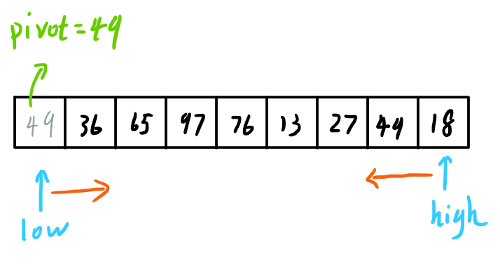

# 排序

## 1、快速排序



快速排序：

```c
void QuickSort(int A[], int low, int high){
    if(low < high){ //跳出的条件
        int pivotpos = Partition(A, low, high); //划分
        QuickSort(A, low, pivotpos-1); //左子表
        QuickSort(A, pivotpos+1, high); //右子表
    }
}
```

划分左右子表：

```c
int Partition(int A[], int low, int high){
    int pivot = A[low];
}
```

