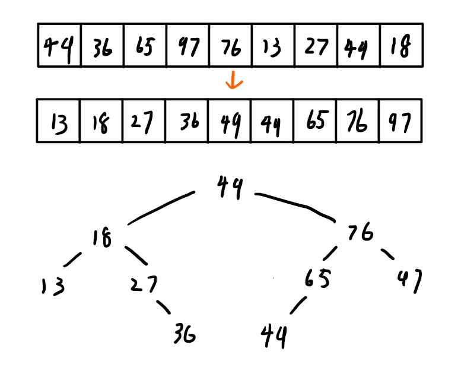

# 排序

## 1、快速排序


快速排序：

```c
void QuickSort(int A[], int low, int high){
    if(low < high){ //跳出的条件
        int pivotpos = Partition(A, low, high); //划分
        QuickSort(A, low, pivotpos-1); //左子表
        QuickSort(A, pivotpos+1, high); //右子表
    }
}
```

划分左右子表：

```c
int Partition(int A[], int low, int high){
    int pivot = A[low];
    while(low < high){ //直到两个指针碰面，退出循环
        while(low < high && A[high] >= pivot){
            high--; //high左边全部大于pivot
        }
        A[low] = A[high]; //将小于pivot的移到右边
        
        while(low<high && A[low] <= pivot){
            low++; //low右边全部小于pivot
        }
        A[high] = A[low] //将大于pivot的移到左边
    }
    
    A[low] = pivot; //pivot的最终位置确定
    return low;
}
```

递归次数：



递归次数=二叉树的深度 $$\in (\log_{2}n -1,n)$$

- 时间复杂度：O(n*递归层数)
  - 最好时间复杂度：O($$n\log_{2}n$$)
  - 最坏时间复杂度：O($$n^{2}$$)
- 空间复杂度：O(递归层数)
  - 最好空间复杂度：O($$\log_{2}n$$)
  - 最坏空间复杂度：O(n)

